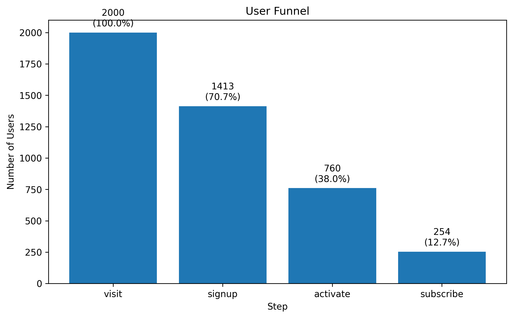
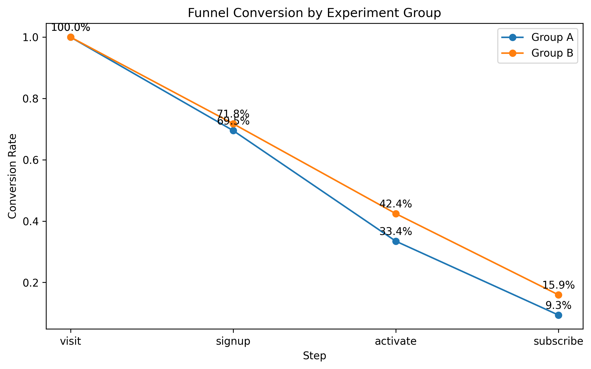
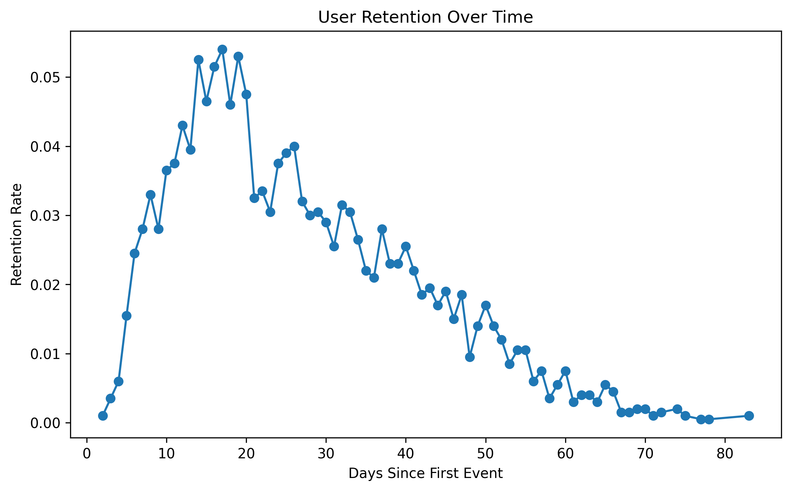

# 📊 SaaS User Retention & Funnel Analysis

## Overview

This project analyzes user behavior in a simulated SaaS product to identify conversion bottlenecks, measure retention, and evaluate the impact of product changes using A/B testing.

The goal is to replicate real-world product analytics workflows used by data scientists and product teams.

---

## 🚀 Key Features

* **Funnel Analysis**

  * Tracks user progression from visit → signup → activation → subscription
  * Identifies major drop-off points

* **A/B Testing**

  * Compares two experiment groups (A vs B)
  * Measures impact on conversion rates across the funnel

* **Retention Analysis**

  * Analyzes how users return over time
  * Builds retention curves using session data

* **Synthetic SaaS Dataset**

  * Realistic event-based dataset with:

    * user behavior
    * acquisition channels
    * device and country segmentation
    * experiment groups

---

## 📁 Project Structure

```
saas_retention_analysis/
├── main.py
├── src/
│   ├── data_generator.py
│   ├── funnel_analysis.py
│   ├── ab_testing.py
│   ├── retention_analysis.py
│   └── visualizer.py
├── images/
│   ├── funnel_chart.png
│   ├── ab_funnel.png
│   └── retention_curve.png
├── README.md
└── requirements.txt
```

---

## 📊 Key Results

### Funnel Analysis

* Visit → Signup: ~70%
* Signup → Activate: ~54%
* Activate → Subscribe: ~33%
* Overall conversion: ~12.7%

📌 **Insight:**
The largest drop-off occurs at the final stage (activation → subscription), indicating an opportunity to improve monetization strategies.

---

### A/B Testing Results

* Group A conversion to subscription: ~9.3%
* Group B conversion to subscription: ~15.9%

📌 **Insight:**
Group B shows a ~70% improvement in conversion rate, suggesting the experimental change significantly improves user conversion.

---

### Retention Analysis

📌 **Insight:**
User retention peaks early and gradually declines over time, which is typical for SaaS products. This highlights the importance of early user engagement and ongoing value delivery.

---

## 📈 Visualizations

### User Funnel



### A/B Test Comparison



### Retention Curve



---

## 🛠️ Technologies Used

* Python
* Pandas
* NumPy
* Matplotlib

---

## 🎯 Business Impact

This project demonstrates how data can be used to:

* Identify where users drop off in a product
* Improve conversion rates through experimentation
* Understand user engagement and retention patterns
* Support product and growth decisions with data

---

## 🔮 Future Improvements

* Add statistical significance testing for A/B experiments
* Build interactive dashboards (Streamlit or Power BI)
* Incorporate SQL-based analysis
* Add cohort-based retention analysis

---

## 💡 Key Takeaway

This project showcases end-to-end product analytics, combining funnel analysis, experimentation, and retention modeling to drive actionable business insights.

---

## 📬 Contact

If you'd like to connect or discuss this project, feel free to reach out via LinkedIn.

